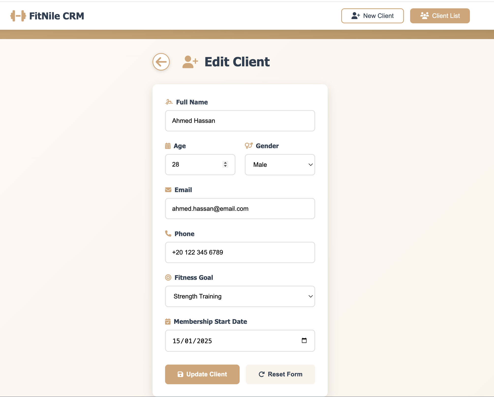
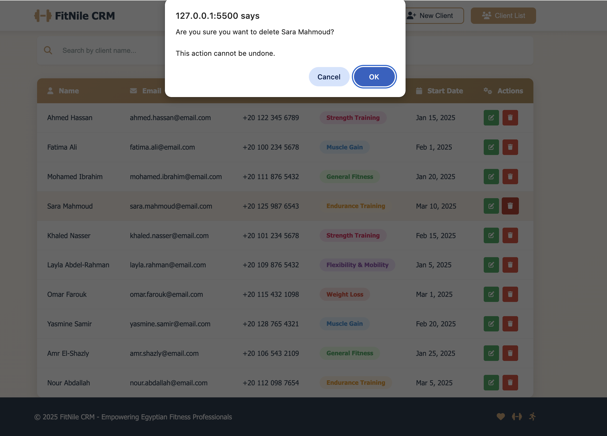
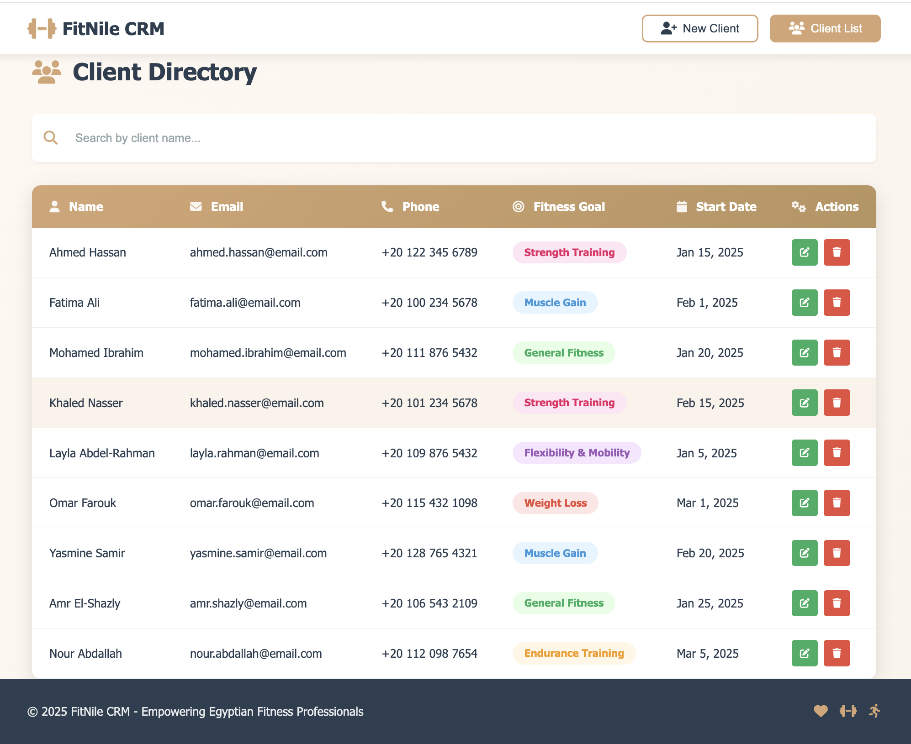
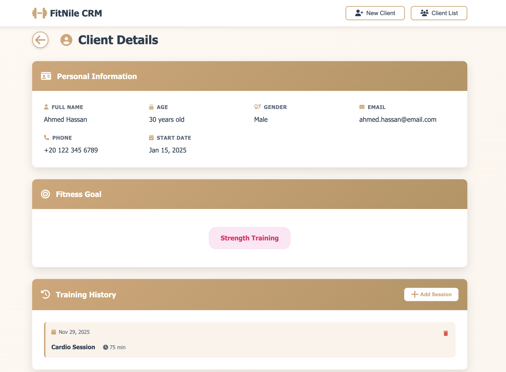
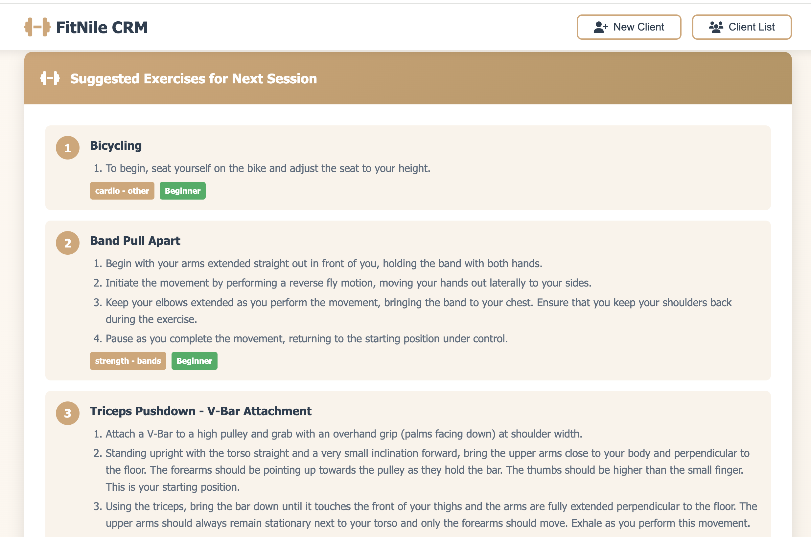
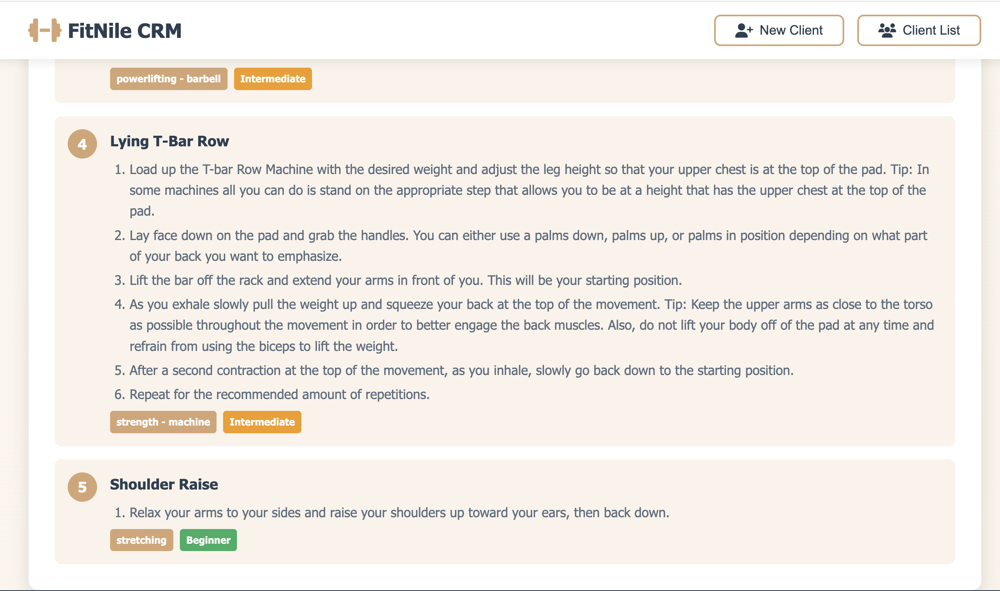

# FitNile CRM

## Project Description

FitNile CRM is a fully functional, lightweight web application designed specifically for fitness professionals in Egypt to manage their client information and track fitness goals. Named after Egypt's iconic Nile River, this CRM combines functionality with a warm, inviting Egyptian-inspired design that makes client management both efficient and enjoyable.

**Assignment 2 Update**: The application now includes complete interactivity with JavaScript, localStorage persistence, comprehensive form validation, and API integration for exercise recommendations.

The application provides an intuitive interface for personal trainers, fitness instructors, and small gym owners to:
- Add and maintain comprehensive client records with localStorage persistence
- Update and delete client information with confirmation prompts
- Track individual fitness goals and progress
- Search and filter through client databases in real-time
- View detailed client profiles with training history
- Get AI-powered exercise recommendations from Wger API
- Manage membership information with full CRUD operations
- Access client data from any device with responsive design

## Features

### Core Functionality (Assignment 2 Complete)

#### Page 1: New Client Form
- **Add Client**: Save client information to localStorage with comprehensive validation
- **Form Validation**: Real-time validation for all fields including:
  - Name validation (minimum 2 characters, letters only)
  - Age validation (must be > 0 and between 16-120)
  - Email format validation (proper email structure)
  - Phone number validation (international format support)
  - Required field validation for all inputs
- **Duplicate Detection**: Prevents adding clients with existing email addresses
- **Success Notifications**: Visual feedback for all operations

#### Page 2: Client List View
- **View Clients**: Click any client row to view detailed profile
- **Edit Functionality**: Update client details with form repopulation
- **Delete Functionality**: Remove clients with confirmation prompt
- **Search Feature**: Real-time filtering by client name
- **Responsive Table**: Transforms to card layout on mobile devices
- **Data Persistence**: All changes saved to localStorage automatically

#### Page 3: Client View (New!)
- **Personal Information Display**: Complete client profile with all details
- **Fitness Goal Visualization**: Color-coded badge display
- **Training History**: View and manage past training sessions
  - Add new training sessions with date, type, duration, and notes
  - Delete training sessions with confirmation
  - Displays session type, duration, and detailed notes
  - Sorted chronologically (newest first)
- **Exercise Recommendations**: 5 random exercises fetched from Free Exercise DB REST API with full instructions
- **Difficulty Levels**: Color-coded badges (beginner/intermediate/expert)
- **Back Navigation**: Easy return to client list

### Data Persistence
- **localStorage Integration**: All client data persists across page refreshes
- **Automatic Initialization**: Loads sample data on first visit
- **Safe Updates**: Preserves data integrity during edit operations

### User Interface Highlights
- Clean, modern design with intuitive navigation
- Color-coded fitness goal badges for easy visual identification
- Interactive hover effects and smooth transitions
- Mobile-first approach with card-based layouts on smaller screens
- Sticky header for easy navigation across pages
- Toast notifications for user feedback
- Loading states for API calls
- Error handling with user-friendly messages
- **Egyptian-Themed UI**: Warm, desert-inspired color palette with subtle Egyptian cultural elements

## Tech Stack

### Frontend Technologies (Assignment 2 Enhanced)
- **HTML5**: Semantic markup for structure and accessibility
- **CSS3**: Modern styling with custom properties, flexbox, and grid layouts
- **JavaScript (ES6+)**: Full interactivity with:
  - LocalStorage API for data persistence
  - Fetch API for REST API integration (Free Exercise DB)
  - Event handling and DOM manipulation
  - Form validation with regex patterns
  - Real-time search filtering
  - Dynamic content rendering

### APIs & External Services
- **Free Exercise DB API**: REST API integration for exercise recommendations
  - Endpoint: `https://raw.githubusercontent.com/yuhonas/free-exercise-db/main/dist/exercises.json`
  - Completely free and open-source (no authentication required)
  - Returns 800+ exercises with complete information
  - Data includes: name, instructions, difficulty level, equipment, target muscles, and category
  - Source: https://github.com/yuhonas/free-exercise-db

### Design Approach
- **CSS Variables**: Consistent theming through custom properties
- **Flexbox & Grid**: Modern layout techniques for responsive design
- **Media Queries**: Breakpoints at 768px (tablet) and 480px (mobile)
- **Mobile-First Design**: Progressive enhancement for larger screens

### Key CSS Features
- Smooth animations and transitions
- Toast notification system
- Form validation error states
- Print-friendly styles
- Responsive table-to-card transformation on mobile
- Custom SVG illustrations
- Loading and error state styling

## File Structure

```
fitcrm/
│
├── index.html          # Main HTML file with 3 pages (New Client, Client List, Client View)
├── css/
│   └── styles.css      # Complete stylesheet with responsive design and new Page 3 styles
├── js/
│   └── main.js         # JavaScript with localStorage, validation, API integration
├── screenshots/        # Screenshot images used in README.md documentation
│   ├── 1_NewClient_Navigation.png
│   ├── 2_Form_Submission.png
│   ├── 3_Added_Client.png
│   ├── 4_reset_form.png
│   ├── 5_ClientList_Navigation.png
│   ├── 6_Clinet_Search.png
│   ├── 7_Search_Results.png
│   ├── 8_Client_Edit.png
│   ├── 9_Client_Delete.png
│   ├── 10_Edit_Client.png
│   ├── 11_Removing_Clinet.png
│   ├── 12_Client_Removed.png
│   ├── 13_Client_View.png
│   ├── 14_Suggested_Exercise_1.png
│   └── 15_Suggested_Exercise_2.png
└── README.md           # Project Documentation

```

## Deployment

### Live Demo
The application is deployed and accessible at: https://fitnile-crm.netlify.app/

### Deployment Method

This project is deployed using **GitHub** and **Netlify** for continuous deployment:

## Application Walkthrough (Assignment 2 - Fully Functional)

### Getting Started - New Client Registration
When you first access FitNile CRM, you'll land on the **New Client** page where you can begin registering fitness clients. The navigation buttons are clearly visible at the top, with "New Client" selected by default.

### Completing the Registration Form with Validation
Fill in all the required client information. The form now features **real-time validation**:
- **Name**: Must be at least 2 characters, letters only
- **Age**: Must be greater than 0 and between 16-120 years
- **Email**: Must be a valid email format (e.g., user@example.com)
- **Phone**: Must be a valid phone number (supports international format)
- **All fields are required** and will show error messages if validation fails

### Submitting Client Information
After entering all client details with valid data, click the **Add Client** button:
- Client is **saved to localStorage** immediately
- A **success notification** appears confirming the addition
- Form is **automatically cleared** for the next entry
- **Duplicate email detection** prevents adding the same client twice
- Navigate to Client List to see your newly added client

### Resetting the Form
Click the **Reset Form** button to instantly clear all fields and begin a fresh client registration.

### Navigating to the Client Directory
Click the **Client List** button in the navigation bar to access your complete client database. All clients are loaded from localStorage and displayed in an organized table format.

### Searching for Specific Clients
Use the search bar at the top of the Client Directory to quickly find specific clients:
- **Real-time filtering** as you type
- Search works across client names
- Shows "No results found" message when no matches exist

### Viewing Client Details (New Feature!)
Click on **any client row** to view their complete profile on Page 3:
- **Personal Information**: All client details in an organized card layout
- **Fitness Goal**: Visual badge display
- **Training History**: View and manage training sessions
  - Click **Add Session** button to record new training sessions
  - Fill in date, session type, duration, and optional notes
  - Delete sessions with the trash icon (requires confirmation)
  - All sessions sorted by date (newest first)
- **Exercise Recommendations**: 5 random exercises with complete step-by-step instructions from Free Exercise DB API
- Click the **back button** to return to the client list

### Visual Walkthrough (Screenshots)
- **Navigate to New Client**: Landing page with New Client tab active  
  
- **Form Submission with Validation**: Completing required fields before adding a client  
  
- **Client Added**: Success feedback after saving the new record  
  
- **Reset Form**: Clear all fields to start a fresh entry  
  
- **Navigate to Client List**: Switch to the directory to view saved clients  
  
- **Client Search**: Type-ahead filtering by client name  
  
- **Search Results**: Filtered table showing matching clients only  
  
- **Edit Client (legacy)**: Launch edit mode from the actions column  
  
- **Delete Client (legacy)**: Remove a client from the list with action buttons  
  
- **Edit Client (pre-update)**: Current client details pre-fill the form for quick edits  
  
- **Delete Confirmation Prompt**: Safety dialog appears when attempting to remove a client  
  
- **Client Deleted**: Success toast confirms the record was removed and the list refreshes  
  
- **Client Profile View**: Detailed profile card with goals, stats, and training history  
  
- **Exercise Suggestions (Set 1)**: Randomized, API-driven recommendations with step-by-step instructions  
  
- **Exercise Suggestions (Set 2)**: Additional suggestions showcasing varied difficulty levels and muscle groups  
  

### Editing Client Information (Fully Functional!)
Click the green **Edit** button (pencil icon) next to any client record:
- Form is automatically **populated with existing data**
- Button changes to "Update Client"
- Make your changes and click "Update Client"
- **All validations still apply** during updates
- **Success notification** confirms the update
- Changes are **saved to localStorage** immediately
- **Duplicate email detection** works during edits (excluding current client)

### Deleting Client Records (With Confirmation!)
Click the red **Delete** button (trash icon):
- **Confirmation dialog** appears with client name
- Confirms "Are you sure?" before deletion
- Client is **removed from localStorage** upon confirmation
- **Success notification** confirms deletion
- Table updates immediately to reflect changes

## Contributing

Contributions are welcome! Please feel free to submit a Pull Request.

1. Fork the repository
2. Create your feature branch (`git checkout -b feature/AmazingFeature`)
3. Commit your changes (`git commit -m 'Add some AmazingFeature'`)
4. Push to the branch (`git push origin feature/AmazingFeature`)
5. Open a Pull Request
