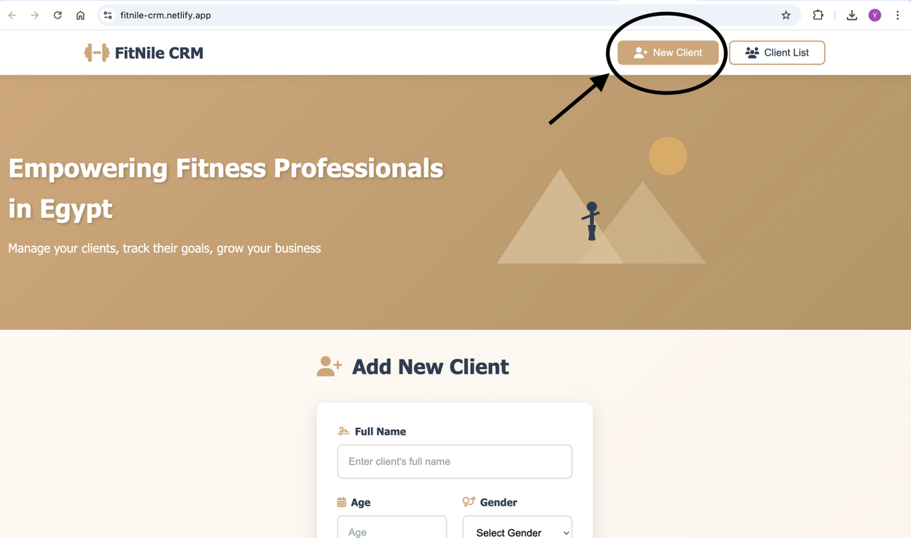
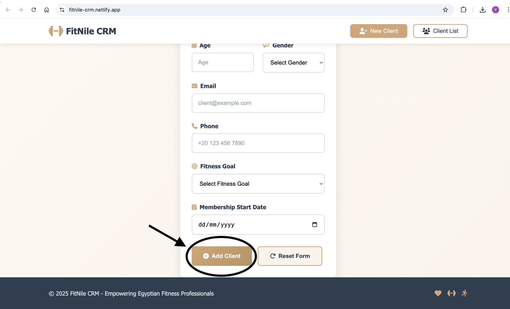
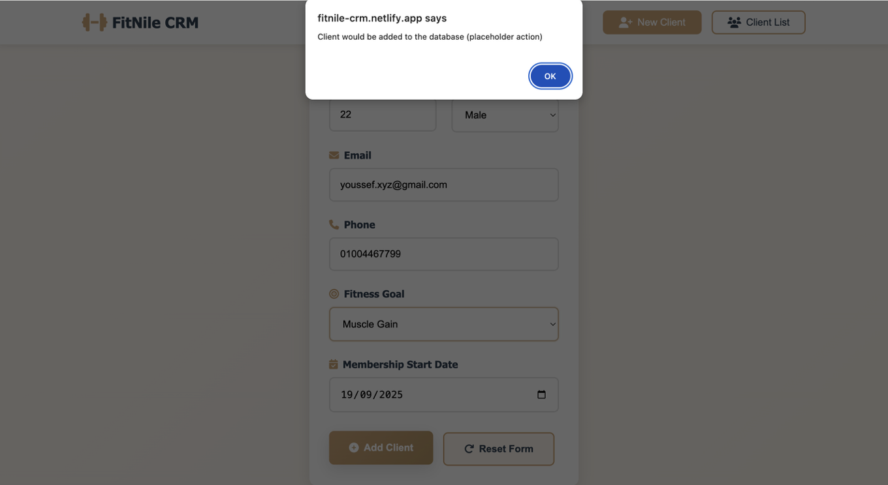
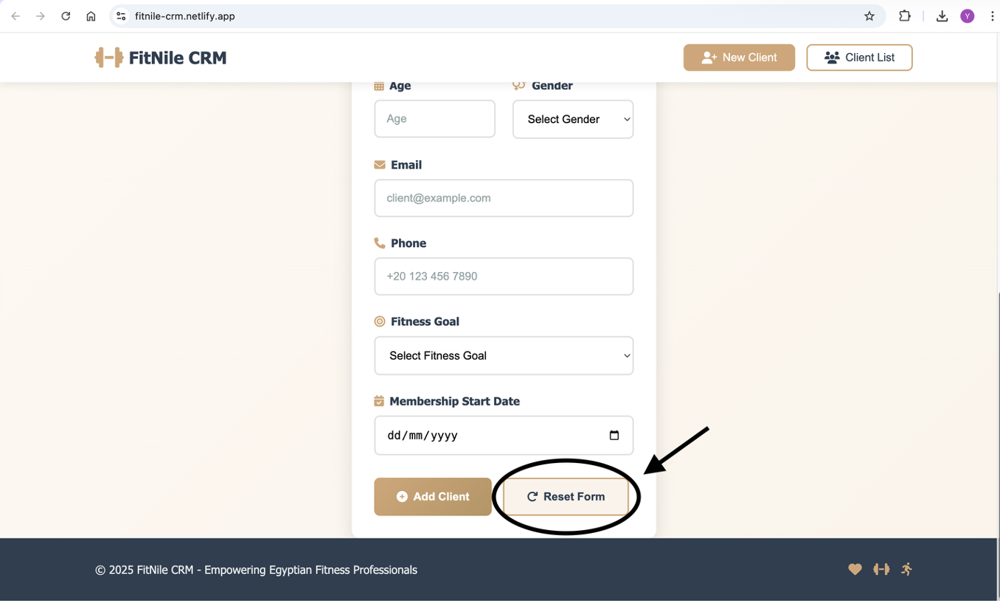
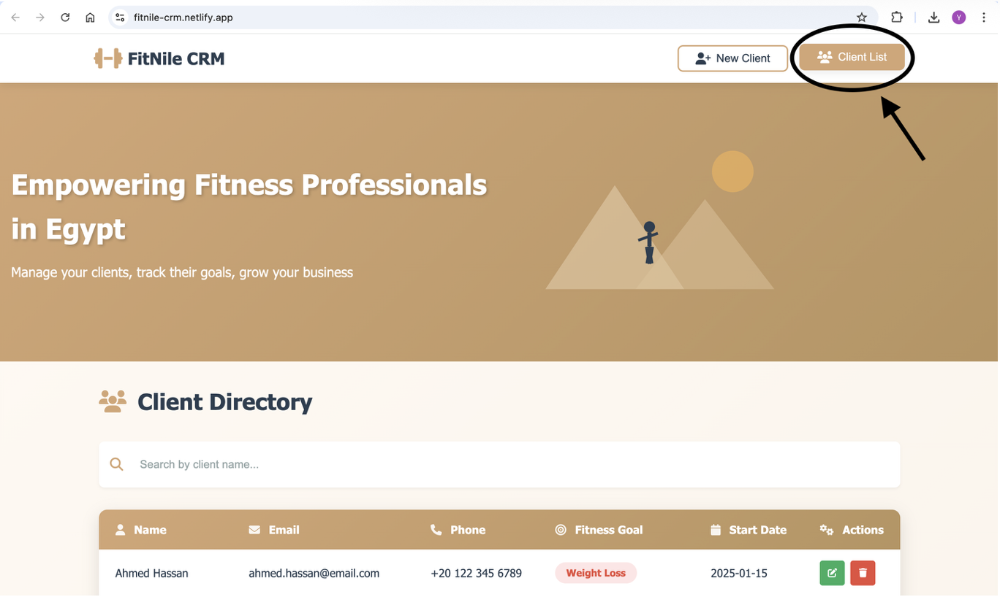
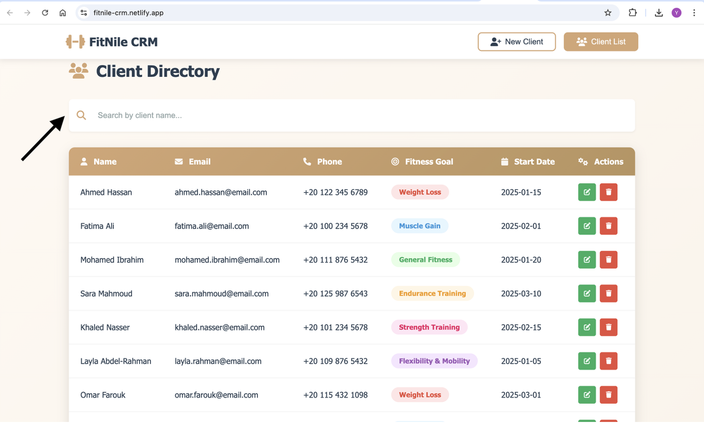
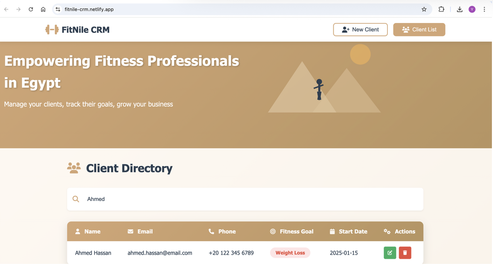
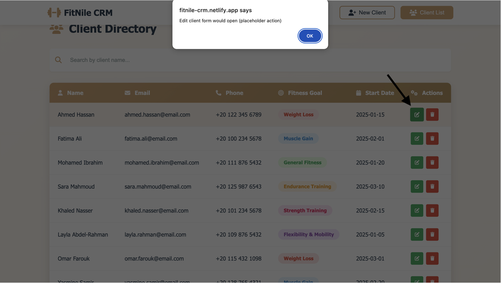
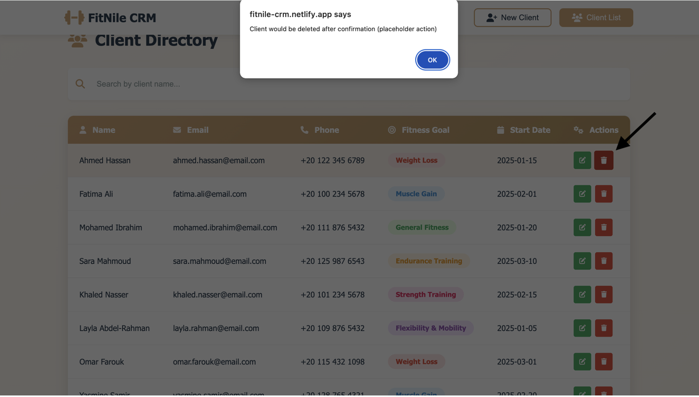

# FitNile CRM

## Project Description

FitNile CRM is a lightweight, responsive web application designed specifically for fitness professionals in Egypt to manage their client information and track fitness goals. Named after Egypt's iconic Nile River, this CRM combines functionality with a warm, inviting Egyptian-inspired design that makes client management both efficient and enjoyable.

The application provides an intuitive interface for personal trainers, fitness instructors, and small gym owners to:
- Add and maintain comprehensive client records
- Track individual fitness goals and progress
- Search and filter through client databases
- Manage membership information
- Access client data from any device with responsive design

## Features

### Core Functionality
- **New Client Registration Form**: Comprehensive form with fields for personal information, fitness goals, and membership details
- **Client Directory**: Searchable table view displaying all clients with their key information
- **Responsive Design**: Fully responsive interface that works seamlessly on desktop, tablet, and mobile devices
- **Egyptian-Themed UI**: Warm, desert-inspired color palette with subtle Egyptian cultural elements

### User Interface Highlights
- Clean, modern design with intuitive navigation
- Color-coded fitness goal badges for easy visual identification
- Interactive hover effects and smooth transitions
- Mobile-first approach with card-based layouts on smaller screens
- Sticky header for easy navigation across pages

## Tech Stack

### Frontend Technologies
- **HTML5**: Semantic markup for structure and accessibility
- **CSS3**: Modern styling with custom properties, flexbox, and grid layouts
- **Vanilla JavaScript**: Lightweight scripting for interactivity and page navigation

### Design Approach
- **CSS Variables**: Consistent theming through custom properties
- **Flexbox & Grid**: Modern layout techniques for responsive design
- **Media Queries**: Breakpoints at 768px (tablet) and 480px (mobile)
- **Mobile-First Design**: Progressive enhancement for larger screens

### Key CSS Features
- Smooth animations and transitions
- Print-friendly styles
- Responsive table-to-card transformation on mobile
- Custom SVG illustrations

## File Structure

```
fitcrm/
│
├── index.html          # Main HTML file with embedded JavaScript
├── css/
│   └── styles.css      # Complete stylesheet with responsive design
├── screenshots/        # Screenshot images used in README.md documentation
│   ├── 1_NewClient_Navigation.png
│   ├── 2_Form_Submission.png
│   ├── 3_Added_Client.png
│   ├── 4_reset_form.png
│   ├── 5_ClientList_Navigation.png
│   ├── 6_Clinet_Search.png
│   ├── 7_Search_Results.png
│   ├── 8_Client_Edit.png
│   └── 9_Client_Delete.png
└── README.md           # Project Documentation
  
```

## Deployment

### Live Demo
The application is deployed and accessible at: https://fitnile-crm.netlify.app/

### Deployment Method

This project is deployed using **GitHub** and **Netlify** for continuous deployment:

## Contributing

Contributions are welcome! Please feel free to submit a Pull Request.

1. Fork the repository
2. Create your feature branch (`git checkout -b feature/AmazingFeature`)
3. Commit your changes (`git commit -m 'Add some AmazingFeature'`)
4. Push to the branch (`git push origin feature/AmazingFeature`)
5. Open a Pull Request

## Application Walkthrough

### Getting Started - New Client Registration
When you first access FitNile CRM, you'll land on the **New Client** page where you can begin registering fitness clients. The navigation buttons are clearly visible at the top, with "New Client" selected by default.



### Completing the Registration Form
Fill in all the required client information including personal details, contact information, fitness goals, and membership start date. The form features intuitive icons and placeholder text to guide you through each field.



### Submitting Client Information
After entering all client details, click the **Add Client** button to register them in the system. A confirmation dialog will appear indicating that the client would be added to the database (currently a placeholder action for demonstration purposes).



### Resetting the Form
Need to clear the form and start over? Simply click the **Reset Form** button to instantly clear all fields and begin a fresh client registration.



### Navigating to the Client Directory
Click the **Client List** button in the navigation bar to access your complete client database. The page displays all registered clients in an organized table format.



### Searching for Specific Clients
Use the search bar at the top of the Client Directory to quickly find specific clients. Simply type any part of the client's name to filter the results in real-time.



### Viewing Search Results
As you type in the search box, the table automatically filters to show only matching clients. In this example, searching for "Ahmed" displays only Ahmed Hassan's record.



### Editing Client Information
Click the green **Edit** button (pencil icon) next to any client record to modify their information. This triggers a placeholder dialog indicating that an edit form would open in a full implementation.



### Deleting Client Records
To remove a client from the database, click the red **Delete** button (trash icon). A confirmation dialog appears to prevent accidental deletions, ensuring data integrity.


